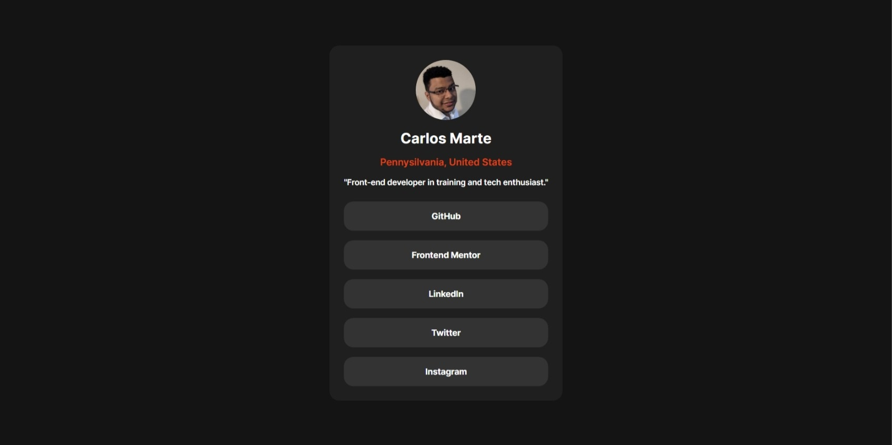

# Frontend Mentor - Social links profile solution

This is a solution to the [Social links profile challenge on Frontend Mentor](https://www.frontendmentor.io/challenges/social-links-profile-UG32l9m6dQ). Frontend Mentor challenges help you improve your coding skills by building realistic projects.

## Table of contents

- [Overview](#overview)
  - [The challenge](#the-challenge)
  - [Screenshot](#screenshot)
  - [Links](#links)
- [My process](#my-process)

  - [Built with](#built-with)
  - [What I learned](#what-i-learned)

- [Author](#author)

**Note: Delete this note and update the table of contents based on what sections you keep.**

## Overview

### The challenge

Users should be able to:

- See hover and focus states for all interactive elements on the page

### Screenshot

### Links

- Solution URL: [Github Repo](https://github.com/carlosmarte23/fem-social-links-profile)
- Live Site URL: [Social links profile on Github Pages](https://carlosmarte23.github.io/fem-social-links-profile/)

## My process

### Built with

- Semantic HTML5 markup
- CSS custom properties
- CSS Grid
- Mobile-first workflow

### What I learned

Used the feedback from the other challenges to structure the HTML and CSS and used better CSS units and selectors. Also started this project with a mobile-first workflow even thhough the designs arent that different between mobile and desktop.

## Author

- Website - [Carlos Marte's Github](https://github.com/carlosmarte23)
- Frontend Mentor - [@carlosmarte23](https://www.frontendmentor.io/profile/carlosmarte23)
